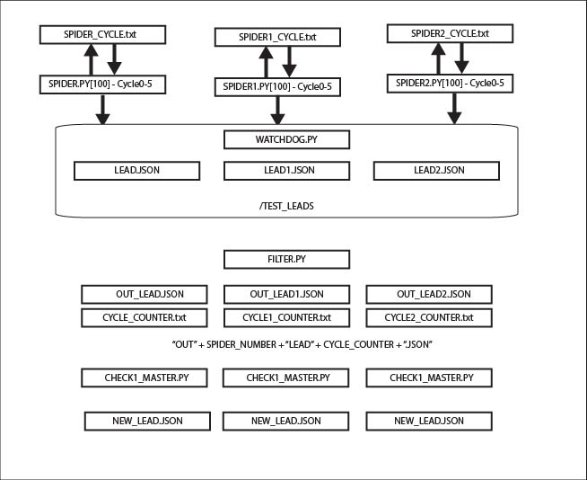
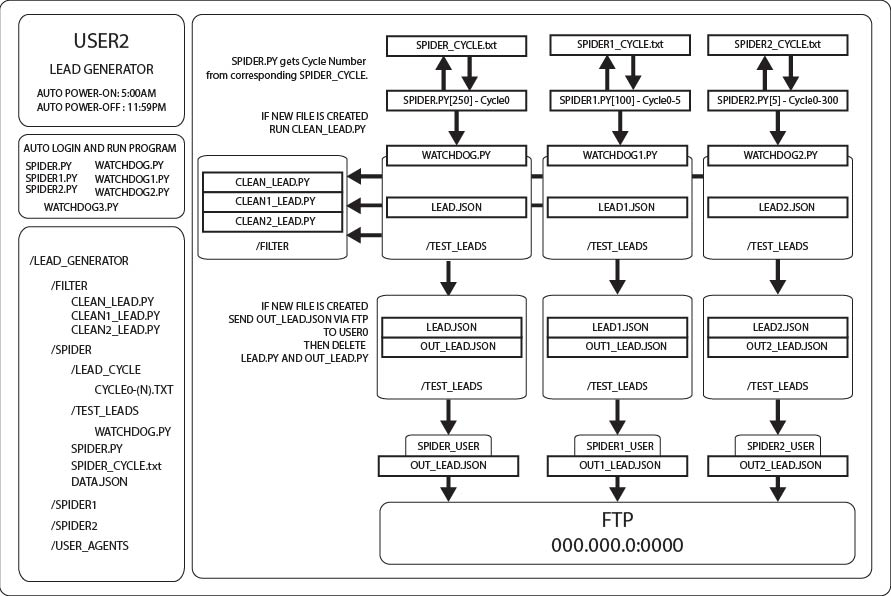
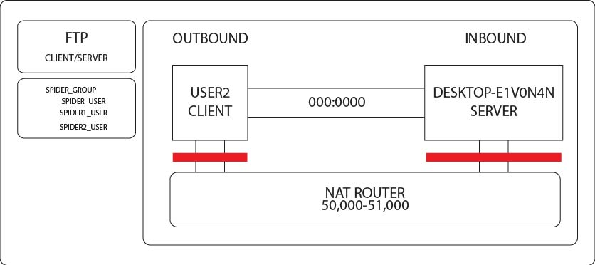
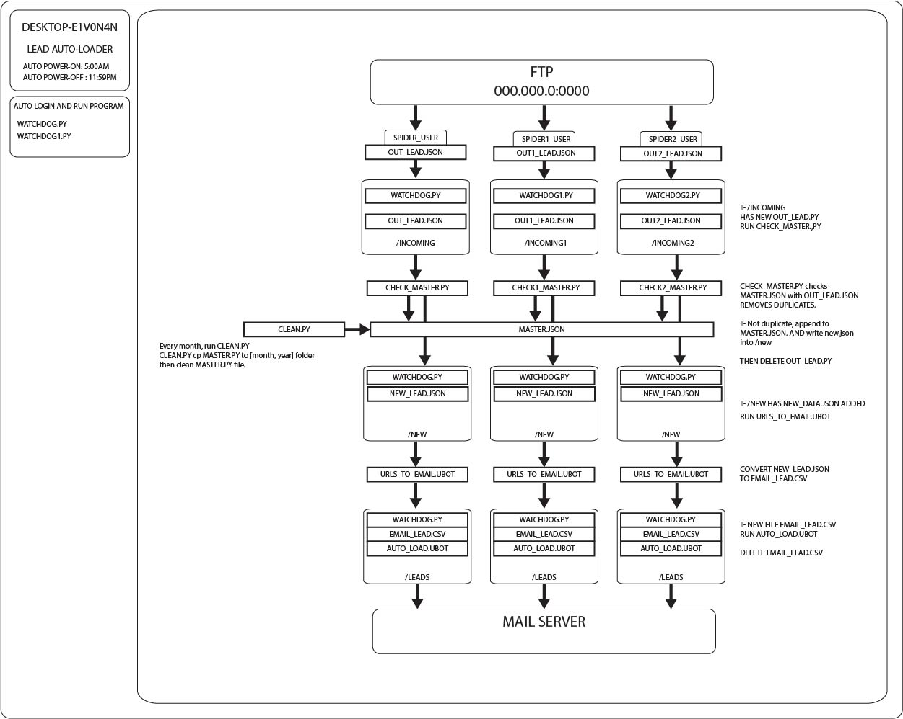
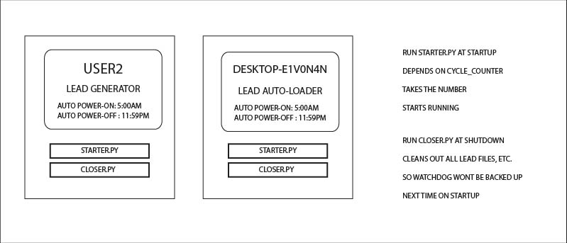

# lead-generator-automailer

- Automatic lead generation with rotating proxies and user agents.

- Three web scrapper spiders simultaneously runs six cycles each depending on traffic level.

- Auto filter system based on keywords and auto removes repeats leads.

- Watchdog software system detects file changes and sends files via FTP between machines.

- Master json file that updates each cycle with new incoming leads.

- Ubot studio Windows macro program automatically gets email address from each lead.

- Macro program automatically loads email address to mail server application and automatically response.

- Auto power on and power off cycles of two local machines

    machine0 lead generator system
    
    machine1 auto mailer system

## Overview

This is custom software system written in Python. 

The lead generator get leads from Craiglists. The lead generator system is on User2 and the Mail Automation system is on Desktop-E1V0N4N. The system takes in URLs and filters them based on keyword and removes duplicates. Then the system transfers the files via FTP to Desktop-E1V0N4N. Once the files, which are JSON objects are transfered via FTP to Desktop-E1V0N4N, WATCHDOG which is a python dependency automatically detects the file and runs check_master.py which takes the leads and compares them to the master.json file. Master.json is where all the leads are stored. The new leads are added to the master.json and a new lead json object is created. Watchdog detects this new lead json object and runs a UBOT STUDIO Executable. This executable takes the urls and converts them to email addresses. This is because Craiglist has server-side javascript that doesn't show the HTML on the client-side without being activated on the client-side. So we are using UBOT STUDIO to automate the mouse click functionality of the system. UBOT STUDIO is a window's application. The email addresses are put into a CSV file. Watchdog then runs another UBOT STUDIO executable, AUTO_LOAD.UBOT This loads the CSV file into the mail server application and sends the mail automatically. The mail server application was Mail-For-Good hosted on an AWS virtual machine.

Because a key component is the automatic poweron and poweroff of the two machines, access to the machine's BIOS or UEFI is required. Which means this system will be difficult to setup with virtual machines, without advanced access to cloud services. Another key component is one of the machines will need to be a Windows machine, because of the use of a Windows desktop automation software. This Automation Software is UBOT Studio which is a pay to use software. Included is the compiled executable as well as the UBOT file. The reasoning behind this is that Craigslist has server-side JavaScript that hides client-side code until activated with user interaction on the web interface. Additionally because File Transfer Protocol is used, access to the internet router to open ports maybe required. This system requires File Locking functionality, to allow for multiple programs to write to one file. Currently it is implemented with Portalocker, which is a cross-platform file locking dependency for Windows and Unix. This system heavily relies on Rotating Proxies, which is a service that changes the IP Address of the machine with each request to the Craigslist servers. As so without a service that provides Rotating Proxies, this system can not function at full capacity.

### Disclaimer

Because this software violates the Terms of Services of Craigslist this system is not be used. This system has components incomplete/missing and will not function as intended.