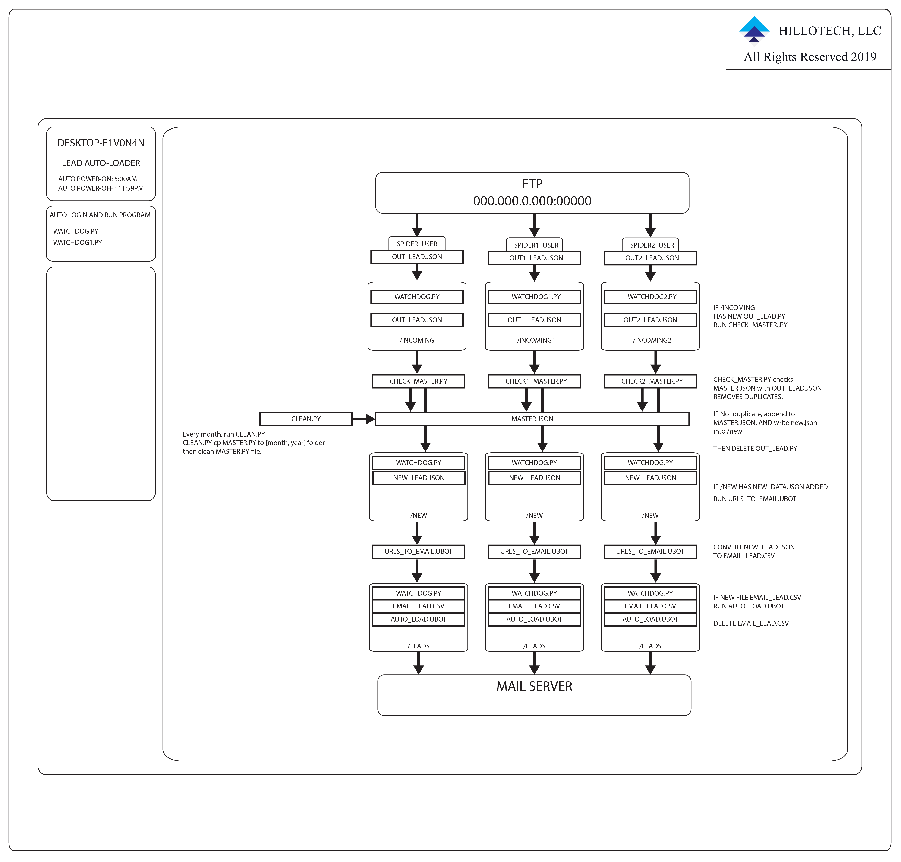

# Lead Auto Loader

    Copyright (C) 2019 Hillotech, LLC. All Rights Reserved
    This program is free software; you can redistribute it 
    and/r modify it under the terms of either the GNU General 
    Public License or the Artistic License. THIS SOFTWARE 
    IS PROVIDED BY THE COPYRIGHT HOLDERS AND CONTRIBUTORS "AS IS"
    AND ANY EXPRESS OR IMPLIED WARRANTIES, INCLUDING, BUT NOT LIMITED 
    TO, THE IMPLIED WARRANTIES OF MERCHANTABILITY AND FITNESS 
    FOR A PARTICULAR PURPOSE ARE DISCLAIMED. IN NO EVENT 
    SHALL THE COPYRIGHT OWNER OR CONTRIBUTORS BE LIABLE 
    FOR ANY DIRECT, INDIRECT, INCIDENTAL, SPECIAL, EXEMPLARY, 
    OR CONSEQUENTIAL DAMAGES (INCLUDING, BUT NOT LIMITED TO, 
    PROCUREMENT OF SUBSTITUTE GOODS OR SERVICES; LOSS OF USE, 
    DATA, OR PROFITS; OR BUSINESS INTERRUPTION) HOWEVER CAUSED 
    AND ON ANY THEORY OF LIABILITY, WHETHER IN CONTRACT, STRICT 
    LIABILITY, OR TORT (INCLUDING NEGLIGENCE OR OTHERWISE) 
    ARISING IN ANY WAY OUT OF THE USE OF THIS SOFTWARE, 
    EVEN IF ADVISED OF THE POSSIBILITY OF SUCH DAMAGE.

## Overview

## Startup Procedure

The program needs to be written to be run with Powershell.

Powershell has Python 3 and 2 installed.

We will have to have 2.7.9 installed which has pip installed by default.

To run a program with Python 2 use:

    py -2 test.py

To run pip with that specific version of python use:

    py -2 -m pip

We are going to be using a cross platform (Windows and UNIX) file locking system called portalocker.

To install portalocker with powershell and pip firstly pip needs to be upgraded.

Use this command to upgrade pip:

    py -2 -m pip install -U pip

Now pip is updated.

To install portalocker run this command:

    py -2 -m pip install portalocker

### Mail Automation

Ubot studio executable runs automatically sends mail.

With Mail for Good and AWS SES, we can send the emails.

## Limited Functionality

The automailer function with UBOT STUDIO does not function.