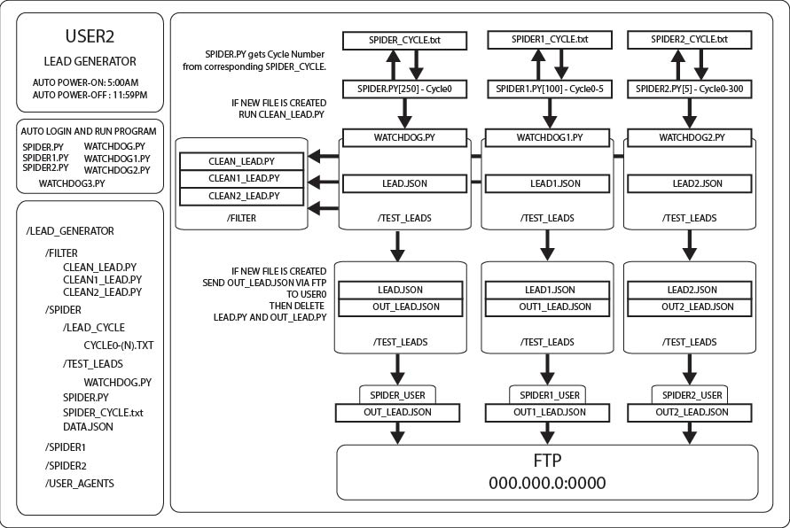

# Lead Generator

## Overview

### Craiglist Scraper

Rotating IP Addresses and User Agents to spoof Craiglist. 

The main program that scrapes is the:

    spider.py

The spider.py file cycles through the URLS which are divided into lead_cycles.

The lead_cycles depend on the traffic of the URLS.

Updates to the:

    spider_cycle.txt

Which keep track on the cycle number.

Once a cycle is completed, the spider.py updated the spider_cycle.txt to the next cycle.

### Filters

Filter based on keywords and duplicates.

    clean_lead.py

Combines the keyword filter and the FTP transfer.

### FTP

The ftp server is located on the Desktop-E1V0N4N machine.

## Limited Functionality

The automailer function with UBOT STUDIO does not fully function but simple construction of macro, a few additional hours.

https://ubotstudio.com/site/ubot-studio-developer-edition/

Optionally can rebuild with any desktop automation language/framework, but mouse click action is required because of Craigslist server-side JavaScript requires user interaction to display certain dynamic client-side data.

### Disclaimer

This software violates the Terms of Services of Craigslist and as so this system is not be used.