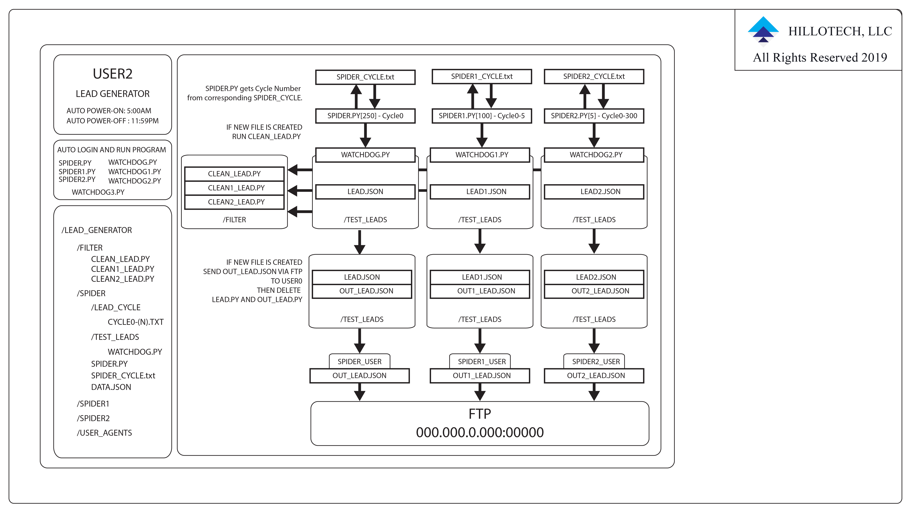

# Lead Generator

    Copyright (C) 2019 Hillotech, LLC. All Rights Reserved
    This program is free software; you can redistribute it 
    and/r modify it under the terms of either the GNU General 
    Public License or the Artistic License. THIS SOFTWARE 
    IS PROVIDED BY THE COPYRIGHT HOLDERS AND CONTRIBUTORS "AS IS"
    AND ANY EXPRESS OR IMPLIED WARRANTIES, INCLUDING, BUT NOT LIMITED 
    TO, THE IMPLIED WARRANTIES OF MERCHANTABILITY AND FITNESS 
    FOR A PARTICULAR PURPOSE ARE DISCLAIMED. IN NO EVENT 
    SHALL THE COPYRIGHT OWNER OR CONTRIBUTORS BE LIABLE 
    FOR ANY DIRECT, INDIRECT, INCIDENTAL, SPECIAL, EXEMPLARY, 
    OR CONSEQUENTIAL DAMAGES (INCLUDING, BUT NOT LIMITED TO, 
    PROCUREMENT OF SUBSTITUTE GOODS OR SERVICES; LOSS OF USE, 
    DATA, OR PROFITS; OR BUSINESS INTERRUPTION) HOWEVER CAUSED 
    AND ON ANY THEORY OF LIABILITY, WHETHER IN CONTRACT, STRICT 
    LIABILITY, OR TORT (INCLUDING NEGLIGENCE OR OTHERWISE) 
    ARISING IN ANY WAY OUT OF THE USE OF THIS SOFTWARE, 
    EVEN IF ADVISED OF THE POSSIBILITY OF SUCH DAMAGE.

## Overview

### Craiglist Scraper

Rotating IP Addresses and User Agents to spoof Craiglist. 

The main program that scrapes is the:

    spider.py

The spider.py file cycles through the URLS which are divided into lead_cycles.

The lead_cycles depend on the traffic of the URLS.

Updates to the:

    spider_cycle.txt

Which keep track on the cycle number.

Once a cycle is completed, the spider.py updated the spider_cycle.txt to the next cycle.

### Filters

Filter based on keywords and duplicates.

    clean_lead.py

Combines the keyword filter and the FTP transfer.

### FTP

The ftp server is located on the Desktop-E1V0N4N machine.

### Urls to Email

Currently using Ubot Studio to get EMAILS from the URLS. 
Need something that will click the button, because without it the 

 with the emails won't show. 
Sever-side Javascript?